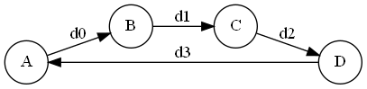
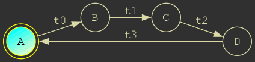
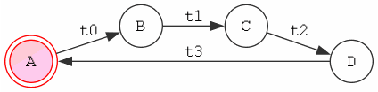

# pyfsm

Module for the management, representation, and analysis of finite state machines (FSM).

## Features

- Define state machines.
- Generate transition matrices.
- Analyze connectivity and accessibility between all states.
- Detect inaccessible or unreachable states.
- Detect windowed state-cycles.
- Detect closed cycles.

## Description

This module provides classes and functions to create, manage, and analyze finite state machines (FSM). It offers tools to represent FSMs, evaluate their structure, and identify important properties such as state accessibility and cycle detection.
The FSM is repretsented by square matrix form where the matrix is an adjacency matrix that represents the directed graph of the deterministic automata.
Here, the rows represent the current state and the columns the next state; each element $a(i,j) = \delta_k$ represents a transition condition which can be 1 or 0, (True or False), 
so in this case i-th state goes to j-th state if k-th condition is true.


<p align="center">
  
</p>

This matrix represents the following FSM: 


<p align="center">
  
</p>


## Installation

Coming soon....

## Usage
```
    def test_fcn():
        return True

    f = fsm()

    f.add_transition('A => B : t0')
    f.add_transition('B => C : t1')
    f.add_transition('C => A : t2')
    f.add_transition('D => A : t3')

    f.add_condition('t0', 'a%10 == 0')
    f.add_condition('t1', 'a%10 == 0')
    f.add_condition('t2', 'a%10 == 0')
    f.add_condition('t3', test_fcn)
    
    f.compile()
    a = 0

    for j in range(130): 
        f.step()
        if (j > 100) and (len(f.true_transitions) != 0): 
            break
        a += 1

    print('done')
    print(f)
```


# pyfsmview 
## Remote HTTP vFSM viewer in real time 
pyfsm view is a minimalist http/websocket server to visualize and debug FSM from pyfsm module in real timeto visualize and debug FSM from pyfsm module on real time.

<p align="center">
    
    Dark mode
</p>
<p align="center">
    
    Ligth mode
</p>

## License

Permission is hereby granted, free of charge, to any person obtaining a copy
of this software and associated documentation files (the "Software"), to deal
in the Software without restriction, including without limitation the rights
to use, copy, modify, merge, publish, distribute, sublicense, and/or sell
copies of the Software, and to permit persons to whom the Software is
furnished to do so, subject to the following conditions:

The above copyright notice and this permission notice shall be included in all
copies or substantial portions of the Software.

THE SOFTWARE IS PROVIDED "AS IS", WITHOUT WARRANTY OF ANY KIND, EXPRESS OR
IMPLIED, INCLUDING BUT NOT LIMITED TO THE WARRANTIES OF MERCHANTABILITY,
FITNESS FOR A PARTICULAR PURPOSE AND NONINFRINGEMENT. IN NO EVENT SHALL THE
AUTHORS OR COPYRIGHT HOLDERS BE LIABLE FOR ANY CLAIM, DAMAGES OR OTHER
LIABILITY, WHETHER IN AN ACTION OF CONTRACT, TORT OR OTHERWISE, ARISING FROM,
OUT OF OR IN CONNECTION WITH THE SOFTWARE OR THE USE OR OTHER DEALINGS IN THE
SOFTWARE.


